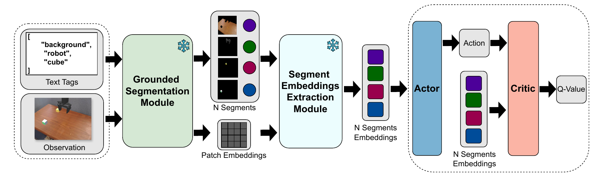

<div align="center" style="margin: 1.2rem 0;">

  <h1 style="margin: 0.2rem 0 0.6rem; font-size: 2.2rem;">
    <span>SegDAC</span>
  </h1>

  <p style="margin: 0 0 0.8rem; font-size: 1.1rem;">
    <strong>Seg</strong>mentation-<strong>D</strong>riven <strong>A</strong>ctor-<strong>C</strong>ritic for Visual Reinforcement Learning
  </p>

  <p>
    <a href="https://segdac.github.io/">
      
    </a>
    <a href="https://arxiv.org/abs/2508.09325">
      
    </a>
    <a href="https://github.com/segdac/SegDAC">
      
    </a>
    <a href="#license">
      
    </a>
  </p>

  <p style="display:inline-flex; gap: 10px; flex-wrap: wrap; justify-content: center;">
    <a href="https://segdac.github.io/" style="text-decoration:none;">
      <span style="display:inline-block; padding: 10px 14px; border-radius: 10px; border: 1px solid #d0d7de;">
        🌐 Project Website
      </span>
    </a>
    <a href="https://arxiv.org/abs/2508.09325" style="text-decoration:none;">
      <span style="display:inline-block; padding: 10px 14px; border-radius: 10px; border: 1px solid #d0d7de;">
        📄 Paper (arXiv)
      </span>
    </a>
  </p>

  <p style="margin: 0.6rem 0; font-size: 0.98rem;">
    <a href="https://alexandrebrown.github.io/">Alexandre Brown</a> ·
    <a href="https://neo-x.github.io/">Glen Berseth</a>
  </p>
  <p style="margin: 0; font-size: 0.95rem; color: #ffffffff;">
    Mila – Quebec AI Institute · Université de Montréal · 2025
  </p>

  <p style="margin: 1rem 0 0.2rem; max-width: 820px;">
    Official PyTorch implementation and resources for </br><strong>SegDAC</strong>: <strong>Seg</strong>mentation-<strong>D</strong>riven <storng>A</storng>ctor-<storng>C</storng>ritic for Visual Reinforcement Learning

  </p>

  <!-- Optional: hero/teaser image (uncomment and replace src) -->
  
  
 
</div>

<hr style="border: 0; border-top: 1px solid #e5e7eb; margin: 1.2rem 0 1.6rem;">

# TODOs
- [x] Add README instructions 
- [x] Add Case Study Videos
- [x] Add Eval & Test Results + Notebook Examples
- [x] Add Baselines Submodules
- [ ] Add Model Code
- [ ] Add Training Code
- [ ] Add Visual Generalization Benchmark Code & Assets
- [ ] Add Links To Model Weights  

## Repo Structure

- Core method code is located under `segdac/`, this code is agnostic to the training and testing pipeline and requires strict minimal dependencies (mainly PyTorch and TensorDict), this was done for ease of reproducibility and code understanding.
- RL training code is located under `segdac_dev/`. 
  - Note: Environment transforms and wrappers needed for SegDAC are also present there but reference the code in `segdac`, see `configs/algo/segdac.yaml` for a complete list of all the classes used by SegDAC and where to find each class.

## Eval & Test Results
- All evaluation and test results are stored as JSON files in the `notebooks/results` directory, this should allow you to compare to SegDAC without needing to re-train it yourself.
  - See the notebook under `notebooks/generate_eval_sample_efficiency_plots.ipynb` for an example on how to load the eval data.
  - See the notebook under `notebooks/generate_visual_generalization_benchmark_plots.ipynb` for an example on how to load the test data.
- Sample efficiency results are stored under `https://github.com/SegDAC/SegDAC/tree/main/notebooks/results/eval/`
- SegDAC test results are stored under `notebooks/results/test/segdac_sac_sam_enc_decoder_q_cond_final_aggregated_scores-0.json`, here final refers to the weights after 1M training steps (as used in the paper).

## Training
Note : The setup assumes you are at the root of this repository, all setup scripts assume this.  
1. ### Setup Simulation Frameworks.

    ### [Maniskill3](https://github.com/haosulab/ManiSkill)    
    ```bash
    source ./envs/maniskill3/setup.sh
    ```  

1. ### Setup SegDAC.
    Run setup script.
    ```bash
    source segdac/setup.sh
    ```

1. ### (Optional) Setup Baselines.    
    This step is only needed if you wish to train/evaluate the baselines.  
    Fetch the baselines repositories :  
    ```bash
    git submodule update --init --recursive
    ```
    #### [DDPG](https://arxiv.org/abs/1509.02971)  
    - No setup required, already included in `segdac`.
    #### [TD3](https://arxiv.org/abs/1802.09477)  
    - No setup required, already included in `segdac`.
    #### [SAC](https://arxiv.org/abs/1812.05905)  
    - No setup required, already included in `segdac`.
    #### [DrqV2](https://arxiv.org/abs/2107.09645)  
    ```bash
    source ./baselines/drqv2/setup.sh
    ```  
    #### [MaDi](https://arxiv.org/abs/2312.15339)  
    ```bash
    source ./baselines/madi/setup.sh
    ```  
    #### [SADA](https://arxiv.org/abs/2405.17416v1)  
    ```bash
    source ./baselines/sada/setup.sh
    ```  
    #### [FTD](https://ojs.aaai.org/index.php/AAAI/article/view/29002)  
    ```bash
    source ./baselines/ftd/setup.sh
    ```  

1. ### Launch Training
    1. (Optional but recommended) Setup CometML logging   
        Note : If you ignore this step, CometML logging will be disabled and while the training will work, you won't get metrics logging during training. Evaluation videos will still be created and model weights will still be saved without CometML logging enabled.   
        ```bash
        export COMET_API_KEY=<YOUR_API_KEY>
        export COMET_PROJECT_NAME=<YOUR_PROJECT_NAME>
        export COMET_WORKSPACE=<YOUR_WORKSPACE>
        ```
    2. Train an algo.  
        See `.vscode/launch.json` for more examples.  
        ```bash
        conda activate maniskill3_env
        ```
        ```bash
        python scripts/train_rl_online.py \
            algo.env.transforms.grounded_seg.segmentation_model.object_detector_weights_path="./weights/yolov8s-worldv2.pt" \
            algo.env.transforms.grounded_seg.segmentation_model.segmenter_weights_path="./weights/efficientvit_sam_l0.pt" \
            +env=maniskill3/push_cube \
            algo=segdac \
            algo/grounding_text_tags=push_cube \
            env.maniskill3.obs_mode.camera_name=base_camera \
            env/maniskill3/obs_mode=proprio_rgb \
            env.pixels.height=512 \
            env.pixels.width=512 \
            logging.video_height=256 \
            logging.video_width=256 \
            algo.agent.critic.gamma=0.80 \
            logging.video_max_steps_per_traj=50 \
            algo.proprioception_dim=9 \
            training.seed=42 \
            evaluation.seed=123
        ```

## Visual Generalization Benchmark
1. See `.vscode/launch.json` for more examples.  
    ```bash
    conda activate maniskill3_env
    ```
    ```bash
    python scripts/test_visual_generalization.py \
      "algo@algo_1=segdac" \
      "algo/grounding_text_tags@algo_1.grounding_text_tags=push_cube" \
      "algo_1.proprioception_dim=9" \
      "env_1.pixels.height=512" \
      "env_1.pixels.width=512" \
      \
      "algo@algo_2=segdac" \
      "algo/grounding_text_tags@algo_2.grounding_text_tags=pull_cube" \
      "algo_2.proprioception_dim=9" \
      "env_2.pixels.height=512" \
      "env_2.pixels.width=512" \
      \
      "algo@algo_3=segdac" \
      "algo/grounding_text_tags@algo_3.grounding_text_tags=pick_cube" \
      "algo_3.proprioception_dim=9" \
      "env_3.pixels.height=512" \
      "env_3.pixels.width=512" \
      \
      "algo@algo_4=segdac" \
      "algo/grounding_text_tags@algo_4.grounding_text_tags=poke_cube" \
      "algo_4.proprioception_dim=9" \
      "env_4.pixels.height=512" \
      "env_4.pixels.width=512" \
      \
      "algo@algo_5=segdac" \
      "algo/grounding_text_tags@algo_5.grounding_text_tags=pull_cube_tool" \
      "algo_5.proprioception_dim=9" \
      "env_5.pixels.height=512" \
      "env_5.pixels.width=512" \
      \
      "algo@algo_6=segdac" \
      "algo/grounding_text_tags@algo_6.grounding_text_tags=lift_peg_upright" \
      "algo_6.proprioception_dim=9" \
      "env_6.pixels.height=512" \
      "env_6.pixels.width=512" \
      \
      "algo@algo_7=segdac" \
      "algo/grounding_text_tags@algo_7.grounding_text_tags=place_apple_in_bowl" \
      "algo_7.proprioception_dim=25" \
      "env_7.pixels.height=512" \
      "env_7.pixels.width=512" \
      "env_7.maniskill3.obs_mode.camera_name=head_camera" \
      \
      "algo@algo_8=segdac" \
      "algo/grounding_text_tags@algo_8.grounding_text_tags=transport_box" \
      "algo_8.proprioception_dim=25" \
      "env_8.pixels.height=512" \
      "env_8.pixels.width=512" \
      "env_8.maniskill3.obs_mode.camera_name=head_camera" \
      \
      "logging.num_rollouts=2" \
      "logging.video_height=256" \
      "logging.video_width=256" \
      \
      "agent_weights.env_1=['weights/segdac_final/push_cube/ms3_push_cube_segdac_final_42.pt','weights/segdac_final/push_cube/ms3_push_cube_segdac_final_43.pt','weights/segdac_final/push_cube/ms3_push_cube_segdac_final_44.pt','weights/segdac_final/push_cube/ms3_push_cube_segdac_final_45.pt','weights/segdac_final/push_cube/ms3_push_cube_segdac_final_46.pt']" \
      "agent_weights.env_2=['weights/segdac_final/pull_cube/ms3_pull_cube_segdac_final_42.pt','weights/segdac_final/pull_cube/ms3_pull_cube_segdac_final_43.pt','weights/segdac_final/pull_cube/ms3_pull_cube_segdac_final_44.pt','weights/segdac_final/pull_cube/ms3_pull_cube_segdac_final_45.pt','weights/segdac_final/pull_cube/ms3_pull_cube_segdac_final_46.pt']" \
      "agent_weights.env_3=['weights/segdac_final/pick_cube/ms3_pick_cube_segdac_final_42.pt','weights/segdac_final/pick_cube/ms3_pick_cube_segdac_final_43.pt','weights/segdac_final/pick_cube/ms3_pick_cube_segdac_final_44.pt','weights/segdac_final/pick_cube/ms3_pick_cube_segdac_final_45.pt','weights/segdac_final/pick_cube/ms3_pick_cube_segdac_final_46.pt']" \
      "agent_weights.env_4=['weights/segdac_final/poke_cube/ms3_poke_cube_segdac_final_42.pt','weights/segdac_final/poke_cube/ms3_poke_cube_segdac_final_43.pt','weights/segdac_final/poke_cube/ms3_poke_cube_segdac_final_44.pt','weights/segdac_final/poke_cube/ms3_poke_cube_segdac_final_45.pt','weights/segdac_final/poke_cube/ms3_poke_cube_segdac_final_46.pt']" \
      "agent_weights.env_5=['weights/segdac_final/pull_cube_tool/ms3_pull_cube_tool_segdac_final_42.pt','weights/segdac_final/pull_cube_tool/ms3_pull_cube_tool_segdac_final_43.pt','weights/segdac_final/pull_cube_tool/ms3_pull_cube_tool_segdac_final_44.pt','weights/segdac_final/pull_cube_tool/ms3_pull_cube_tool_segdac_final_45.pt','weights/segdac_final/pull_cube_tool/ms3_pull_cube_tool_segdac_final_46.pt']" \
      "agent_weights.env_6=['weights/segdac_final/lift_peg_upright/ms3_lift_peg_upright_segdac_final_42.pt','weights/segdac_final/lift_peg_upright/ms3_lift_peg_upright_segdac_final_43.pt','weights/segdac_final/lift_peg_upright/ms3_lift_peg_upright_segdac_final_44.pt','weights/segdac_final/lift_peg_upright/ms3_lift_peg_upright_segdac_final_45.pt','weights/segdac_final/lift_peg_upright/ms3_lift_peg_upright_segdac_final_46.pt']" \
      "agent_weights.env_7=['weights/segdac_final/apple_in_bowl/ms3_apple_in_bowl_segdac_final_42.pt','weights/segdac_final/apple_in_bowl/ms3_apple_in_bowl_segdac_final_43.pt','weights/segdac_final/apple_in_bowl/ms3_apple_in_bowl_segdac_final_44.pt','weights/segdac_final/apple_in_bowl/ms3_apple_in_bowl_segdac_final_45.pt','weights/segdac_final/apple_in_bowl/ms3_apple_in_bowl_segdac_final_46.pt']" \
      "agent_weights.env_8=['weights/segdac_final/transport_box/ms3_transport_box_segdac_final_42.pt','weights/segdac_final/transport_box/ms3_transport_box_segdac_final_43.pt','weights/segdac_final/transport_box/ms3_transport_box_segdac_final_44.pt','weights/segdac_final/transport_box/ms3_transport_box_segdac_final_45.pt','weights/segdac_final/transport_box/ms3_transport_box_segdac_final_46.pt']"
    ```

# Citation
Please use the following BibTeX entry to cite our work:

```
@misc{brown2025segdacsegmentationdrivenactorcriticvisual,
      title={SegDAC: Segmentation-Driven Actor-Critic for Visual Reinforcement Learning}, 
      author={Alexandre Brown and Glen Berseth},
      year={2025},
      eprint={2508.09325},
      archivePrefix={arXiv},
      primaryClass={cs.CV},
      url={https://arxiv.org/abs/2508.09325}, 
}
```